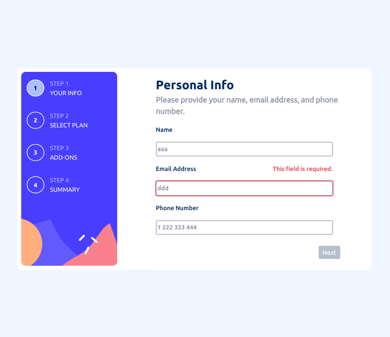
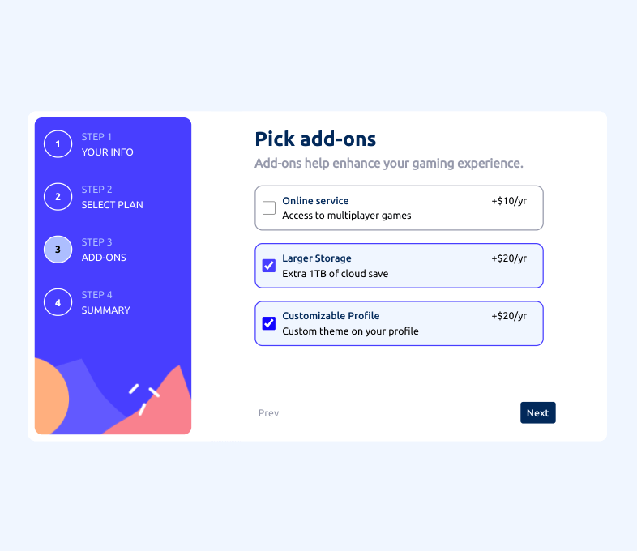
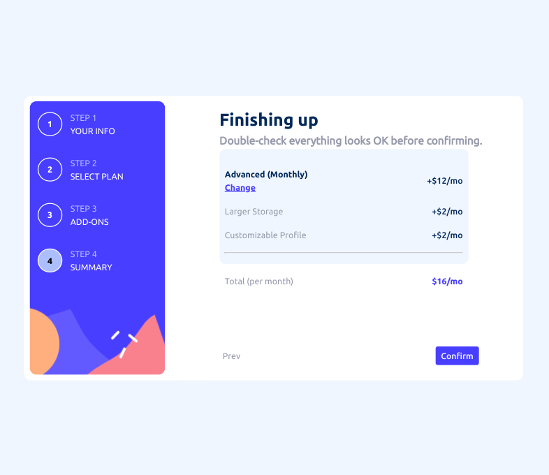

# React Multi-Step Form

This is a solution to the [Multi-step form challenge on Frontend Mentor](https://www.frontendmentor.io/challenges/multistep-form-YVAnSdqQBJ).Frontend Mentor challenges help you improve your coding skills by building realistic projects. 

## Table of contents

- [Overview](#overview)
  - [The challenge](#the-challenge)
  - [Screenshot](#screenshot)
- [My process](#my-process)
  - [Built with](#built-with)
  - [What I learned](#what-i-learned)
  - [Continued development](#continued-development)
  - [Useful resources](#useful-resources)

## Overview

### The challenge

Users should be able to:

- Complete each step of the sequence
- See a summary of their selections on the final step and confirm their order
- View the optimal layout for the interface depending on their device's screen size
- See hover and focus states for all interactive elements on the page

### Screenshot

## My process

### Built with

- Semantic HTML5 markup
- CSS custom properties
- Flexbox
- CSS Grid
- Mobile-first workflow
- React

### What I learned

Validation for a multi-step form in React is a more of hassle than vanilla js.  I don't want to make the 'next' buttons submit buttons and essentially submit the form multiple times to get standard html validation as seen in this [Web Dev Simplified Tutorial](https://www.youtube.com/watch?v=uDCBSnWkuH0).  Another option is to use a library or custom solution to check the inputs on the click of the next button.  You could use Yup separately or in conjunction with formik or react hook form.  Looked into using onBlur event handler to add 'This field is required' just in step 1 component. 

Using :invalid on email input is not very robust - it only checks to see if there is an @ character in the string.  Using this email regex /^\S+@\S+\.\S+$/ is too strict when combined with my styling choice to show input is invalid.

You don't get validation feedback on an empty name input field.  The input outline will always be blue.

I think you could make a multi-step form in React without using context or global state but it seems like it would be awkward. 

### Continued development

- Better Semantic HTML
- CSS cleanup 
- The order of the addons can change in the summary page and not match the order of the checkboxes.
- Separate checkboxes handler maybe can be combined with other change handler so there is only one onChange handler. 
- Use more state to help display more error messages to user - requires next button to not be disabled?
- Add testing 

### Useful resources

- [YouTube](https://www.youtube.com/watch?v=QSBc8bABwE0) - dave gray multi-step form in react
- [React Tips](http://react.tips/radio-buttons-in-reactjs/) - radio buttons in react
- [PluralSight](https://www.pluralsight.com/guides/how-to-use-radio-buttons-in-reactjs) - radio buttons in react
- [Robin Wieruch](https://www.robinwieruch.de/react-checkbox/) - react checkbox
- [Geeks for Geeks](https://www.geeksforgeeks.org/how-to-get-multiple-checkbox-values-in-react-js/) - multiple checkbox values in react
- [Free Code Camp](https://www.freecodecamp.org/news/how-to-work-with-multiple-checkboxes-in-react/) - using index to handle multiple checkboxes in react
- [Medium](https://medium.com/@wlodarczyk_j/handling-multiple-checkboxes-in-react-js-337863fd284e) - handling multiple checkboxes
- [YouTube](https://www.youtube.com/watch?v=81gvCHNSnH8) - multiple checkboxes with more complete state than just an empty array
- [Code Sandbox](https://codesandbox.io/s/y5b2j) - react multi-step form with validation from validator package
- [Stack Overflow](https://stackoverflow.com/questions/4964691/super-simple-email-validation-with-javascript) - super simple email validation js
- [Stack Overflow](https://stackoverflow.com/questions/16699007/regular-expression-to-match-standard-10-digit-phone-number) - regex for standard 10 digit phone number
- [Medium](https://medium.com/web-dev-survey-from-kyoto/how-to-handle-invalid-user-inputs-in-react-forms-for-ux-design-best-practices-e3108ef8a793) - invalid user inputs in react forms